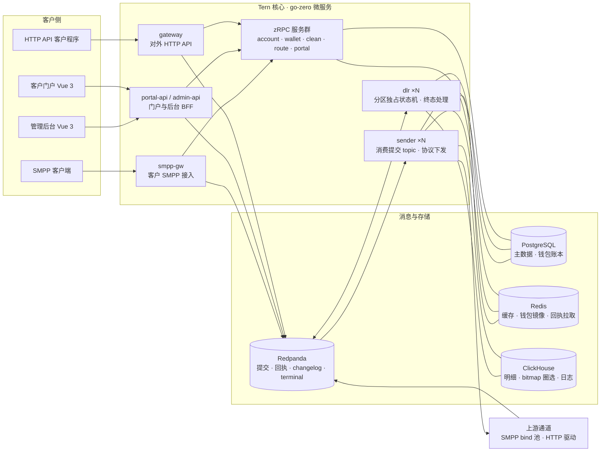

<h1 align="center">🐦 Tern</h1>
<p align="center"><strong>纯国际商业短信（A2P SMS）平台</strong></p>
<p align="center"><sub>代号取自北极燕鸥（<i>Sterna paradisaea</i>）——只飞国际航线，从不停留国内。</sub></p>

---

Tern 是一个面向国际市场的 A2P 短信平台：客户经 **HTTP API、SMPP 3.4 或门户**提交短信，平台完成名单风控、通道路由、协议下发、回执归一、计费结算与统计报表的全链路。架构按**日千万级发送量**设计。

**立项约束（已冻结）**

- **纯国际业务**：协议仅 SMPP 3.4 + HTTP，通道仅国际服务商，不含任何国内运营商能力。
- **复用不改动**：既有 sms 工作区四仓库只作设计参考与逻辑复用来源（架构蓝本以 RCS-SYSTEM 为主），不做任何修改。
- **全新 API**：不兼容老平台对外 API，无迁移包袱。
- 内容审核与词库/模板类内容策略暂缓（名单类风控保留）。

## 仓库

| 仓库 | 定位 | 当前阶段 |
|---|---|---|
| [`sms`](https://github.com/ternsms/sms) | Tern 主仓（monorepo）：go-zero 后端 13 个服务 + 客户门户 `portal-vue` + 管理后台 `admin-vue` + 部署与 CI | **V0 出口条件于 2026-09-09 达成，推进 V1 商用验收**（[v0-plan](https://github.com/ternsms/sms/blob/main/docs/v0-plan.md)） |
| [`legacy-smpp-proxy`](https://github.com/ternsms/legacy-smpp-proxy) | 独立的老系统接入代理：Tern 作为 SMPP 串联代理站在老系统与上游之间（smpp-gw → 透传管线 + link 短链替换 → sender），老系统零改造 | 已完成模拟 e2e 与多轮百万级压测；真实通道灰度与生产上线待验收 |
| [`.github`](https://github.com/ternsms/.github) | 组织主页与每日贡献看板 | 看板每日自动更新 |

<sub>`sms` 与 `legacy-smpp-proxy` 为私有仓库，仓库及文档链接需相应访问权限；本页为公开概览。</sub>

## 核心主线：SMPP 中转清洗

Tern 的核心角色是一个**带号码清洗能力的 SMPP 中转站**——客户 SMPP 接入 → 中转环节剔除黑名单/空号/异常号码 → SMPP 转发上游。这是 V1 的第一优先级链路，其余能力都围绕它展开。

```
客户 SMPP 客户端（bind 鉴权 → submit_sm / 长短信 UDH 重组）
  或 HTTP API（API Key + HMAC 鉴权 → 提交）
  → 中转清洗（全内存 roaring bitmap + 不可变快照，零存储 IO）
      ① E.164 规范化与格式校验
      ② 黑名单（客户级 / 系统池 / 全局）
      ③ 空号库（UNDELIV 失败阈值自动拉黑）
      ④ 异常号码（超频、特殊号段、非目标国）
      ⑤ 白名单池模式（产品开启时仅放行池内号码）
  → 通道池路由 → 上游 SMPP bind 池 / HTTP 驱动
  → DLR 归一化 → 终态收敛与结算 → deliver_sm / Webhook 回传客户
```

## 号码质量双闭环

**号码质量池**：通过名单风控、池内选号与号码冷静期维护号码质量；产品开启「池模式」后按配置约束可选号码。池轮换控制重复触达，点击归因与无点击冷却用于持续维护池内号码，不将单次送达等同于长期有效，也不承诺固定的送达率提升。

**高点击池 + 点击率达标补发（点击率闭环）**：平台短链 302 归因点击，被点击号码进入第二档高点击池。任务可设目标点击率（分母冻结为原始提交数），观察窗口内未达标时按缺口从高点击池选号补发，循环至达标/封顶/池耗尽/超时。补发号码逐号过完整清洗，照常计费，原发/补发分列统计。合规边界（跨客户共享池、补发同意基础）在法务评审前不冻结商用条款。

## 核心契约

- **产品级计费模式**：按短信分段计量（GSM7 160/153、UCS2 70/67）。`SUBMIT` 提交扣费，常规发送失败不退，未进入下发链路的撤回与队列滞留超时按规则退回；`SUCCESS` 提交冻结，按对客终态核销或释放。对客成功投影也属于结算语义，不能将 `SUCCESS` 简化为仅按真实上游送达收费。
- **消息状态机**：`ACCEPTED → SUBMITTED → DELIVRD | UNDELIV | EXPIRED | REJECTD`，平台拦截直接 `BLOCKED`。DLR 使用分区独占的内存状态机，以 Redpanda changelog 恢复状态、terminal topic 驱动终态后续处理；终态不可变，迟到/重复回执不重复推进状态或结算。
- **金额与账本**：全链路「万分之一 USD」定点 BIGINT；BIGINT id 过 JS 一律十进制字符串。扣费、冻结、核销与释放走幂等账本，并与消息明细对账。

## 架构



| 服务 | 类型 | 职责 |
|---|---|---|
| `gateway` | go-zero API | 对外 HTTP API v1：鉴权（API Key + HMAC 签名）、限流、提交/查询 |
| `portal-api` / `admin-api` | go-zero API | 门户与后台 BFF，独立部署与权限体系 |
| `smpp-gw` | 常驻服务 | 客户 SMPP 3.4 server：bind 会话、submit_sm、deliver_sm 回传 |
| `clean-rpc` | zRPC | 中转清洗核：bitmap 名单 + 白名单池 + 运营商判定快照，全内存判定 |
| `account-rpc` | zRPC | 客户/产品/API 凭证/SenderID 许可主数据 |
| `wallet-rpc` | zRPC | 钱包与账本：余额预判、提交扣费、成功计费的冻结/核销/释放、幂等落账与对账 |
| `route-rpc` | zRPC | 路由决策：通道池派生、WRR/成本优先、令牌桶配额 |
| `portal-rpc` | zRPC | 门户用户域：登录用户 / 邀请 / 找回 / 替身 code / 恢复码 / 登录日志的唯一读写者 |
| `sender` | worker | 消费 Redpanda 提交 topic，管理通道并发、上游 SMPP bind 池与 HTTP 驱动 |
| `dlr` | worker | 回执归一化、分区独占状态机、changelog/终态发布，驱动结算、明细与对客回执 |
| `link` | go-zero API | 平台短链：生成/替换、302 归因、驱动高点击池入池 |
| `report` | API + 定时任务 | CH 报表、日对账；补发控制器按观察窗口驱动补发循环 |

**技术栈**：Go + go-zero（zRPC + etcd 服务发现，`.api`/`.proto` 为契约单一事实源）· Vue 3 + Vite（门户 `portal-vue`：Ant Design Vue · 后台 `admin-vue`：Element Plus，均 pnpm workspace，契约 OpenAPI 生成 API 客户端）· Redpanda（Kafka 兼容消息主干）· PostgreSQL 16+ · Redis 7+（缓存、钱包镜像及部分流，按用途分实例）· ClickHouse（明细与 bitmap 圈选）。Docker Compose 用于开发与验收，生产容量和高可用配置需单独验证。

**关键机制**：终态不可变、幂等账本、分区独占状态机 + changelog 恢复、bitmap 圈选、不可变配置快照 + 版本信号热更新、SMPP bind 池（reconcile/退避重连/窗口管理）、唯一写者原则。

<sub>图示为主仓逻辑架构，省略短链、报表及回执接入细节；独立的 `legacy-smpp-proxy` 保留裁剪后的六服务与 Redis Stream 管线，不套用主仓消息架构。</sub>

## 分期规划

| 版本 | 主题 | 范围概要 |
|---|---|---|
| **V0 最小可用闭环** | 已完成出口验收 | 客户「激活 → 2FA → USDT 固定地址充值 → 网页/API 发送（含短链 + 点击率补发）→ 查明细」；运营「开户 → 名单冷启动 → 人工充值 → 看发送任务 → 日志定位」。初期依赖 seed 的配置入口在后续版本逐步开放；V0 发送失败不重路由 |
| **V1 商用闭环** | 能收钱、能发出去、账是平的 | SMPP 中转清洗；账户/产品/USD 钱包 + 加密货币充值；HTTP + SMPP 双接入；号码质量池；短链归因与点击率补发；通道池路由与管理；SenderID 登记/许可/轮换池；SUBMIT / SUCCESS 计费；Redpanda 消息主干；CH 报表。已实现能力继续接受真实通道、容量与上线前置验收 |
| **V2 运营完备** | 后续规划，按验收调整 | 失败补发链；发送全形态与完整链试发；子账户；HLR 检测；通道告警；退订（STOP）自动处理；报表全量 + 实时大屏；i18n；细粒度 RBAC |
| **V3 生态扩展** | 渠道与商业模式扩张 | 代理分销；白标 SaaS；RCS / WhatsApp / Viber 多产品线；AI 助手 |

## 性能目标（V1）

以下为设计与验收目标，不代表当前生产实测结果；模拟器或隔离环境验收不等同于商用上线。

| 指标 | 目标 |
|---|---|
| 日发送量 | 1000 万/日，峰值 5000 msg/s |
| 提交 API 延迟 | P99 < 150ms（含风控与计费） |
| 端到端时延 | 提交 → 发往上游 P95 < 5s |
| DLR 处理能力 | ≥ 2× 提交吞吐 |
| 报表查询 | 亿级明细 bitmap 圈选 P95 < 3s |
| 可用性 | 核心链路 99.95%；RPO ≤ 5min，RTO ≤ 30min |

## 里程碑

- ✅ **M0 · 契约冻结** — PRD 评审、计费/状态机契约、`.api`/`.proto` 草案、PG/CH 表结构
- ✅ **V0 · 最小可用闭环** — 2026-09-09 完成客户与运营两条走查、前后端接线及出口验收
- **M1 · 中转闭环** — 双端模拟器 e2e 全链路：清洗/白名单池/轮换/冷静期用例，万级消息三方对平零差异
- **M2 · 真通道 + 名单资产** — 首批 HTTP 驱动（3–5 家）+ 真实 SMPP 上游、补发闭环 e2e、参数调参
- **M3 · V1 商用** — 门户/后台全集 + USDT 充值 + 监控告警 + 多实例部署，压测达标

## 状态

✅ **V0 出口验收完成，持续完善 V1 能力与上线准备** — 2026-09-20

- **主仓 `sms`**：2026-09-09 达成 V0 出口条件，客户与运营走查及关闭前回归完成。后台发送任务页、短链替换、发送确认、点击率补发与点击入池已完成 V0 接线；不再处于「仅剩后台任务页」阶段。
- **消息与计费**：消息主干已切换至 Redpanda，DLR 采用分区独占状态机与 changelog；产品支持 `SUBMIT` 提交扣费及 `SUCCESS` 提交冻结、终态结算两种模式。
- **SenderID**：登记、许可、轮换池与产品路由页签已合入主仓，轮换由后端执行。9/20 隔离真栈验收通过，**不代表共享服务升级或生产部署**；具体使用仍受功能配置与产品模式约束。
- **通道管理**：列表、详情、新建、编辑、启停、删除、连接测试以及直投诊断试发、监控已接线；完整发送链试发仍属后续范围。
- **USDT 充值**：固定收款地址（TRC20）模式已落地；链上到账先登记为客户级「待指派」，由运营指派产品钱包后幂等落账。
- **`legacy-smpp-proxy`**：独立的六服务透传代理，含短链替换与回执返还；已完成模拟 e2e、多轮压测与背压验收，持续加固。模拟验收不等于真实通道灰度或生产上线。
- **上线边界**：V0 完成与 V1 增量合入不等于商用发布。真实供应商码表、真实通道验证、生产容量与部署配置继续按[上线清单](https://github.com/ternsms/sms/issues/339)推进；性能指标仍按目标列示。

<sub>安全基线：密钥零硬编码、凭证 AES-256-GCM 落库、SSRF 防线、内部端点强鉴权、后台强制 2FA、GDPR 数据主体权利支持（明细 CH TTL 1 年）。</sub>

<!-- org-stats:start -->
## 贡献看板

<sub>覆盖 ternsms 组织全部非归档仓库的默认分支，已剔除机器人提交与看板自身的更新 · 每日 00:00（北京时间）自动更新 · 2026-09-23 03:27 CST</sub>

<p align="center">
  
</p>
<p align="center">
  
</p>
<p align="center">
  
</p>
<!-- org-stats:end -->
