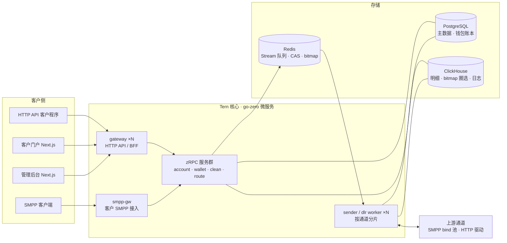

<h1 align="center">🐦 Tern</h1>
<p align="center"><strong>纯国际商业短信（A2P SMS）平台</strong></p>
<p align="center"><sub>代号取自北极燕鸥（<i>Sterna paradisaea</i>）——只飞国际航线，从不停留国内。</sub></p>

---

Tern 是一个面向国际市场的 A2P 短信平台：客户经 **HTTP API、SMPP 3.4 或门户**提交短信，平台完成名单风控、通道路由、协议下发、回执归一、计费结算与统计报表的全链路。架构按**日千万级发送量**设计。

**立项约束（已冻结）**

- **纯国际业务**：协议仅 SMPP 3.4 + HTTP，通道仅国际服务商，不含任何国内运营商能力。
- **复用不改动**：既有 sms 工作区四仓库只作设计参考与逻辑复用来源（架构蓝本以 RCS-SYSTEM 为主），不做任何修改。
- **全新 API**：不兼容老平台对外 API，无迁移包袱。
- 内容审核与词库/模板类内容策略暂缓（名单类风控保留）。

## 核心主线：SMPP 中转清洗

Tern 的核心角色是一个**带号码清洗能力的 SMPP 中转站**——客户 SMPP 接入 → 中转环节剔除黑名单/空号/异常号码 → SMPP 转发上游。这是 V1 的第一优先级链路，其余能力都围绕它展开。

```
客户 SMPP 客户端 / HTTP API
  → bind 鉴权（连接数/流速配额）→ submit_sm（长短信 UDH 重组）
  → 中转清洗（全内存 roaring bitmap + 不可变快照，零存储 IO）
      ① E.164 规范化与格式校验
      ② 黑名单（客户级 / 系统池 / 全局）
      ③ 空号库（UNDELIV 失败阈值自动拉黑）
      ④ 异常号码（超频、特殊号段、非目标国）
      ⑤ 白名单池模式（产品开启时仅放行池内号码）
  → 通道池路由 → 上游 SMPP bind 池 / HTTP 驱动
  → DLR 归一化 → 终态 CAS → deliver_sm / Webhook 回传客户
```

## 号码质量双闭环

**白名单池（送达率闭环）**：每个 DELIVRD 号码在终态 CAS 同一事件里写入平台全局白名单池，形成不断提纯的优质号码资产。产品开启「池模式」后仅放行池内号码，送达率显著高于全量盲发。配套两个质量维护机制：

- **池轮换**——同一号码在轮换间隔内不重复放行，按"最久未使用优先"均匀轮转，防止优质号码被高频受扰打废；
- **号码冷静期**——连续 N 次未落地进入冷静期，期满试探、失败则按倍率升级（T→T×k→T×k²），达上限踢出池；再次送达则重新入池。

**高点击池 + 点击率达标补发（点击率闭环）**：平台短链 302 归因点击，被点击号码进入第二档高点击池。任务可设目标点击率（分母冻结为原始提交数），观察窗口内未达标时按缺口从高点击池选号补发，循环至达标/封顶/池耗尽/超时。补发号码逐号过完整清洗，照常计费，原发/补发分列统计。合规边界（跨客户共享池、补发同意基础）在法务评审前不冻结商用条款。

## 冻结契约

- **提交计费**：提交即按分段数扣费（GSM7 160/153、UCS2 70/67），余额不足整批拒绝；清洗命中（BLOCKED）同样计费，仅从下发链路剔除；任何终态不影响已扣金额。退款设计整体暂缓。每日对平断言「CH 计费计数 × 单价 == 扣费总额 == 账本流水和」。
- **消息状态机**：`ACCEPTED → SUBMITTED → DELIVRD | UNDELIV | EXPIRED | REJECTD`，平台拦截直接 `BLOCKED`。单一 Redis Lua 终态 CAS 入口，终态不可变，迟到/重复回执只补写存证。
- **金额**：全链路「万分之一 USD」定点 BIGINT；BIGINT id 过 JS 一律十进制字符串。

## 架构



| 服务 | 类型 | 职责 |
|---|---|---|
| `gateway` | go-zero API | 对外 HTTP API v1：鉴权（API Key + HMAC 签名）、限流、提交/查询 |
| `portal-api` / `admin-api` | go-zero API | 门户与后台 BFF，独立部署与权限体系 |
| `smpp-gw` | 常驻服务 | 客户 SMPP 3.4 server：bind 会话、submit_sm、deliver_sm 回传 |
| `clean-rpc` | zRPC | 中转清洗核：bitmap 名单 + 白名单池 + 运营商判定快照，全内存判定 |
| `account-rpc` | zRPC | 客户/产品/API 凭证/SenderID 许可主数据 |
| `wallet-rpc` | zRPC | 钱包与账本：余额预判、扣费合并落账、对账（幂等键唯一出口） |
| `route-rpc` | zRPC | 路由决策：通道池派生、WRR/成本优先、令牌桶配额 |
| `sender` | worker | 按通道分片 lease 消费提交流，持有上游 SMPP bind 池与 HTTP 驱动 |
| `dlr` | worker | 回执归一化、终态 CAS、CH 状态更新、outbox 分发 |
| `link` | go-zero API | 平台短链：生成/替换、302 归因、驱动高点击池入池 |
| `report` | API + 定时任务 | CH 报表、日对账；补发控制器按观察窗口驱动补发循环 |

**技术栈**：Go + go-zero（zRPC + etcd 服务发现，`.api`/`.proto` 为契约单一事实源）· Next.js（门户 + shadcn/ui 后台）· PostgreSQL 16+ · Redis 7+（按用途分实例）· ClickHouse（roaring bitmap 物化视图圈选）。V1 单机 docker compose 起步，扩容期平移 K8s。

**关键机制继承**（老系统生产验证）：终态 CAS、幂等账本、bitmap 圈选、不可变配置快照 + 版本信号热更新、SMPP bind 池（reconcile/退避重连/窗口管理）、唯一写者原则。

## 分期规划

| 版本 | 主题 | 范围概要 |
|---|---|---|
| **V1 商用闭环** | 能收钱、能发出去、账是平的 | SMPP 中转清洗主线；账户/产品/USD 钱包 + 加密货币充值；HTTP + SMPP 双接入；名单风控；白名单池（含轮换/冷静期）；短链归因 + 高点击池 + 点击率达标补发；通道池路由；终态 CAS；提交计费；CH 报表；门户与后台最小集；日千万级分片架构 |
| **V2 运营完备** | 运营与客户体验补全 | 失败补发链；SenderID 池三件套；发送全形态；子账户；HLR 检测；通道告警；退订（STOP）自动处理；报表全量 + 实时大屏；i18n；细粒度 RBAC |
| **V3 生态扩展** | 渠道与商业模式扩张 | 代理分销；白标 SaaS；RCS / WhatsApp / Viber 多产品线；AI 助手 |

## 性能目标（V1）

| 指标 | 目标 |
|---|---|
| 日发送量 | 1000 万/日，峰值 5000 msg/s |
| 提交 API 延迟 | P99 < 150ms（含风控与计费） |
| 端到端时延 | 提交 → 发往上游 P95 < 5s |
| DLR 处理能力 | ≥ 2× 提交吞吐 |
| 报表查询 | 亿级明细 bitmap 圈选 P95 < 3s |
| 可用性 | 核心链路 99.95%；RPO ≤ 5min，RTO ≤ 30min |

## 里程碑

- **M0 · 契约冻结** — PRD 评审、计费/状态机契约、`.api`/`.proto` 草案、PG/CH 表结构
- **M1 · 中转闭环** — 双端模拟器 e2e 全链路：清洗/白名单池/轮换/冷静期用例，万级消息三方对平零差异
- **M2 · 真通道 + 名单资产** — 首批 HTTP 驱动（3–5 家）+ 真实 SMPP 上游、补发闭环 e2e、参数调参
- **M3 · V1 商用** — 门户/后台全集 + USDT 充值 + 监控告警 + 多实例部署，压测达标

## 状态

🚧 **PRD 0.1 草案 · 待评审（M0）** — 2026-08-20

<sub>安全基线：密钥零硬编码、凭证 AES-256-GCM 落库、SSRF 防线、内部端点强鉴权、后台强制 2FA、GDPR 数据主体权利支持（明细 CH TTL 1 年）。</sub>

<!-- org-stats:start -->
## 贡献看板

<sub>覆盖 ternsms 组织全部非归档仓库的默认分支，已剔除机器人提交与看板自身的更新 · 每日 00:00（北京时间）自动更新 · 2026-09-02 03:05 CST</sub>

<p align="center">
  
</p>
<p align="center">
  
</p>
<p align="center">
  
</p>
<!-- org-stats:end -->
